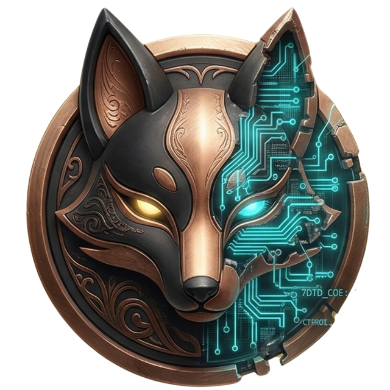

# 🦊 KitsunePaint

<p align="center"></p>

> A web-based custom paint pack creator for 7 Days to Die.

Upload your textures, preview how they tile on a wall, download a ready-to-install modlet. No Unity knowledge required.

## What it does

1. **Upload** — drag and drop your PNG textures (diffuse required, normal/specular optional)
2. **Preview** — see how your texture tiles on a simulated block wall before you commit
3. **Configure** — name your paint, pick a group, tweak tiling
4. **Download** — get a complete `.zip` modlet ready to drop into your `Mods/` folder

## Dependencies

- [OCBCustomTextures](https://www.nexusmods.com/7daystodie/mods/2788) core mod (EAC must be off)
- 7 Days to Die V2.0+

## Tech Stack

- Vite + React + TypeScript
- Tailwind CSS

## Project Structure

```
src/
  components/     # Reusable UI components
  pages/          # Route-level page components
  hooks/          # Custom React hooks
  types/          # TypeScript type definitions
  utils/          # Helper functions
  stores/         # State management
```

## Part of the Kitsune Ecosystem

- [KitsuneDen](https://github.com/AdaInTheLab/KitsuneDen) — home server dashboard
- [KitsuneCommand](https://github.com/AdaInTheLab/KitsuneCommand) — 7D2D server mod
- **KitsunePaint** — custom paint pack creator ← you are here

---

<p align="center">
  <svg width="48" height="56" viewBox="0 0 80 96" xmlns="http://www.w3.org/2000/svg" style="image-rendering:pixelated">
    <rect x="8" y="64" width="8" height="8" fill="#f97316"/>
    <rect x="4" y="56" width="8" height="12" fill="#f97316"/>
    <rect x="2" y="48" width="6" height="12" fill="#f97316"/>
    <rect x="4" y="44" width="6" height="8" fill="#f97316"/>
    <rect x="8" y="40" width="4" height="8" fill="#f97316"/>
    <rect x="4" y="60" width="6" height="8" fill="#fbbf24"/>
    <rect x="2" y="52" width="5" height="8" fill="#fbbf24"/>
    <rect x="24" y="48" width="32" height="24" rx="2" fill="#f97316"/>
    <rect x="20" y="52" width="8" height="16" rx="1" fill="#f97316"/>
    <rect x="52" y="52" width="8" height="16" rx="1" fill="#f97316"/>
    <rect x="28" y="68" width="8" height="12" fill="#f97316"/>
    <rect x="44" y="68" width="8" height="12" fill="#f97316"/>
    <rect x="24" y="60" width="12" height="10" fill="#fde68a"/>
    <rect x="44" y="60" width="12" height="10" fill="#fde68a"/>
    <rect x="24" y="72" width="10" height="4" fill="#78350f"/>
    <rect x="46" y="72" width="10" height="4" fill="#78350f"/>
    <rect x="22" y="20" width="36" height="32" rx="4" fill="#f97316"/>
    <rect x="18" y="28" width="10" height="18" rx="2" fill="#f97316"/>
    <rect x="52" y="28" width="10" height="18" rx="2" fill="#f97316"/>
    <rect x="26" y="28" width="28" height="22" fill="#fde68a"/>
    <rect x="22" y="8" width="12" height="16" rx="2" fill="#f97316"/>
    <rect x="25" y="10" width="6" height="10" fill="#fda4af"/>
    <rect x="46" y="8" width="12" height="16" rx="2" fill="#f97316"/>
    <rect x="49" y="10" width="6" height="10" fill="#fda4af"/>
    <rect x="28" y="32" width="8" height="6" rx="1" fill="#1c1917"/>
    <rect x="44" y="32" width="8" height="6" rx="1" fill="#1c1917"/>
    <rect x="29" y="33" width="6" height="4" rx="1" fill="#fbbf24"/>
    <rect x="45" y="33" width="6" height="4" rx="1" fill="#fbbf24"/>
    <rect x="31" y="33" width="2" height="2" fill="#ffffff"/>
    <rect x="47" y="33" width="2" height="2" fill="#ffffff"/>
    <rect x="37" y="39" width="6" height="4" rx="1" fill="#fda4af"/>
    <rect x="34" y="42" width="12" height="2" fill="#78350f"/>
    <rect x="24" y="24" width="32" height="4" fill="#ea580c"/>
    <rect x="16" y="30" width="6" height="3" fill="#f97316"/>
    <rect x="58" y="30" width="6" height="3" fill="#f97316"/>
  </svg>
  <br/>
  <sub>Powered by the Skulk</sub>
</p>
